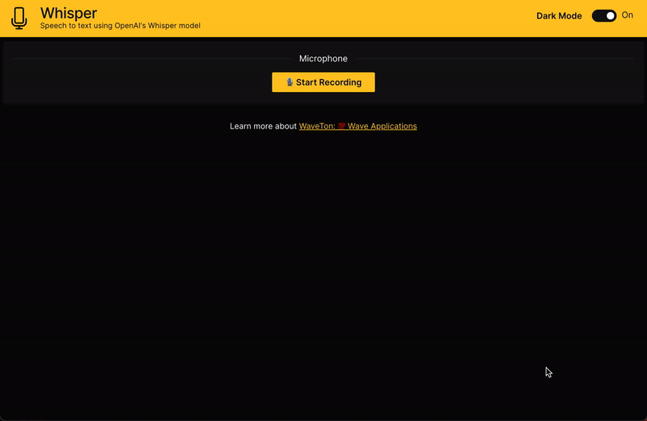

<div align='center'>

<h1>WaveTon</h1>
💯 Wave applications

<br>
<br>

[](https://github.com/vopani/waveton/blob/master/LICENSE)
[](https://img.shields.io/github/stars/vopani/waveton?color=yellowgreen&logo=github)
[](https://twitter.com/vopani)

</div>

## Whisper 🖥️
Speech to text using OpenAI's Whisper model.



## Setup ⚙️
1. Check the version of Python, must be Python 3.9+ but recommended to use Python 3.10+ for best experience

```commandline
python3 --version
```

2. Clone the repository

```commandline
git clone https://github.com/vopani/waveton.git
```

3. Create a virtual environment

```commandline
cd waveton/apps/deeplearning_apps/whisper
python3 -m venv venv
source venv/bin/activate
```

4. Install ffmpeg

On Linux:
```commandline
sudo apt update && sudo apt install ffmpeg
```

On Mac:
```commandline
brew install ffmpeg                         
```

5. Install the packages

```commandline
python3 -m pip install -U pip
python3 -m pip install -r requirements.txt
```

6. Run the application

```commandline
wave run app
```

7. View the application on your local browser: [http://localhost:10101](http://localhost:10101)
